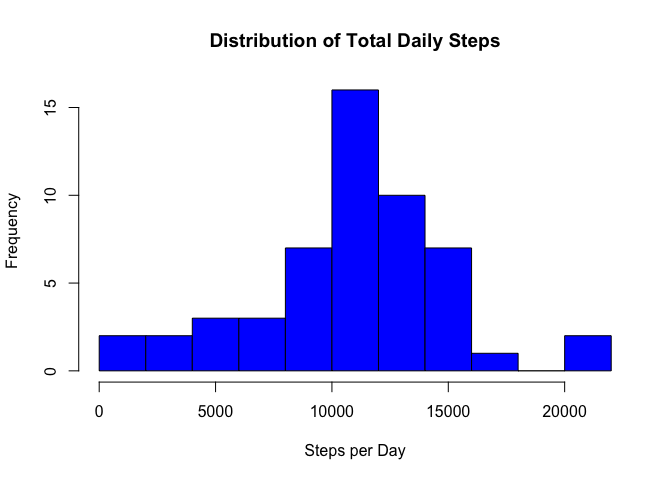
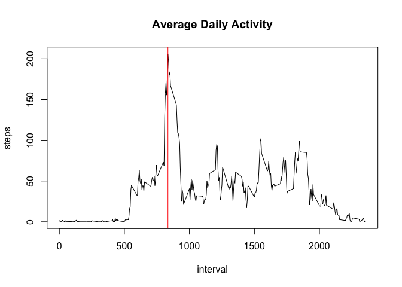
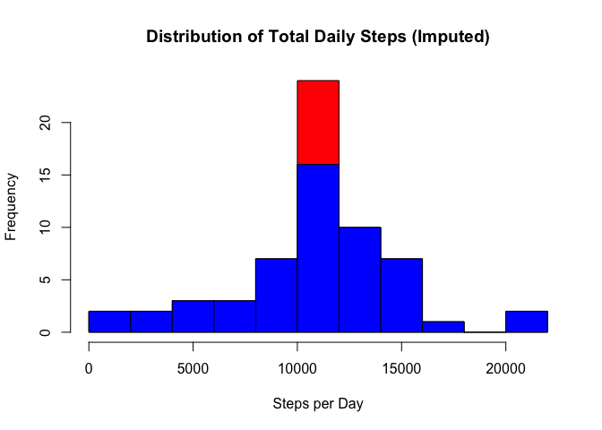
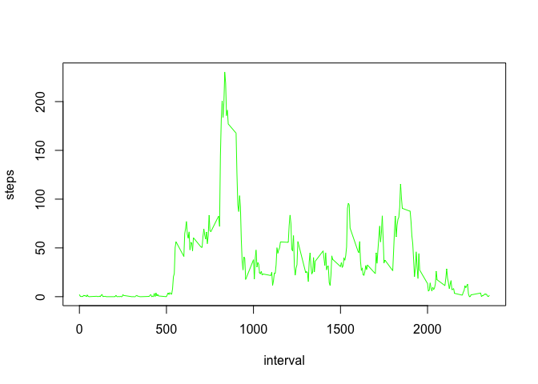
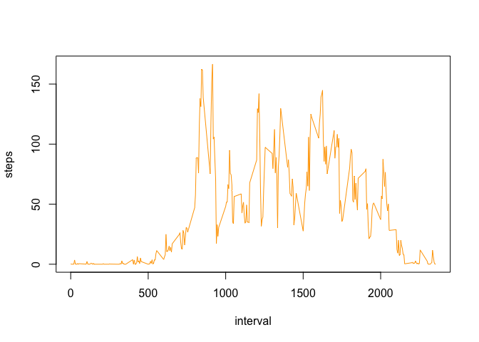

# Reproducible Research: Peer Assessment 1


## Loading and preprocessing the data
Unzip the file 'activity.zip', then read the contents of the extracted CSV file into a dataframe called *act*.

```r
unzip('activity.zip')
act <- read.csv('activity.csv', header = TRUE)
```

## What is mean total number of steps taken per day?
Calculate the number of steps each day, then plot the results in a histogram.

```r
total_steps <- aggregate(steps ~ date, data=act, FUN = sum, na.rm = TRUE)
hist(total_steps$steps, breaks  = 10, xlab = "Steps per Day", main = "Distribution of Total Daily Steps", col = rgb(0,0,1,1))
```

<!-- -->

We compute the mean and median of the daily steps as follows:

```r
mean_steps <- mean(total_steps$steps)
median_steps <- median(total_steps$steps)
```

and find that the daily mean is 1.0766189\times 10^{4} and the daily median is 10765.

## What is the average daily activity pattern?
We compute the average steps taken in a given interval, then plot these as a line graph. We also find the interval with the maximum daily average steps and mark it on the plot as a red vertical line.

```r
agg <- aggregate(steps ~ interval, data = act, FUN = mean, na.rm = TRUE)
plot(agg, type = 'l', main = "Average Daily Activity")
max_interval <- agg$interval[which.max(agg$steps)]
abline(v = max_interval, col = "red")
```

<!-- -->

The interval with the maximum average daily steps is 835.

## Imputing missing values
We identify rows that contain missing values ('NA') by checking if any of the columns is NA and then count them.

```r
act$has_NA <- !complete.cases(act)
num_NAs <- sum(act$has_NA)
```

We found that 2304 rows contain missing values.

We impute the missing values in a new dataframe *act2* as the daily average value for the relevant 5-minute interval as follows:

```r
act2 <- act
act2[act$has_NA,'steps'] <- agg[match(act[act$has_NA,'interval'],agg$interval),'steps']
```

We now plot the distribution of daily average steps using the imputed dataframe. 

```r
itotal_steps <- aggregate(steps ~ date, data=act2, FUN = sum, na.rm = TRUE)
hist(itotal_steps$steps, breaks  = 10, xlab = "Steps per Day", main = "Distribution of Total Daily Steps (Imputed)", col = rgb(1,0,0,1))
hist(total_steps$steps, breaks  = 10, xlab = "Steps per Day", main = "Distribution of Total Daily Steps", col = rgb(0,0,1,1), add = TRUE)
```

<!-- -->

The imputed distribuiton is in red, behind the original distribution shown in blue. We can see that the imputed values are represented by the additional counts in red in the middle of the histogram.

Looking at the new mean and median daily values:

```r
imean_steps <- mean(itotal_steps$steps)
imedian_steps <- median(itotal_steps$steps)
```

We see that the mean of daily steps has stayed at 1.0766189\times 10^{4} (from 1.0766189\times 10^{4}) but the median has shifted to 1.0766189\times 10^{4} (from 10765).

## Are there differences in activity patterns between weekdays and weekends?
We add a new factor variable *daytype* to our dataframe with imputed values:

```r
act2$daytype <- factor(weekdays(as.Date(act2$date)) %in% c('Saturday','Sunday'),levels=c(FALSE, TRUE), labels=c("weekday","weekend"))
wkday <- act2[act2$daytype == 'weekday',]
wkend <- act2[act2$daytype == 'weekend',]
meanwkday <- aggregate(steps ~ interval, data = wkday, FUN = mean, na.rm = TRUE)
meanwkend <- aggregate(steps ~ interval, data = wkend, FUN = mean, na.rm = TRUE)

plot(meanwkday, type ='l',col="green")
```

<!-- -->

```r
plot(meanwkend, type = 'l', col = "orange")
```

<!-- -->
